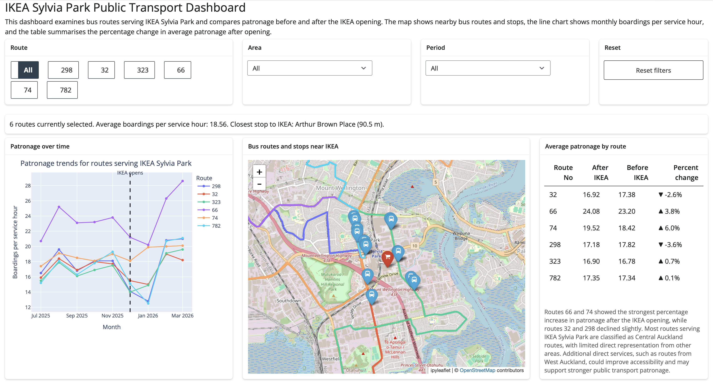
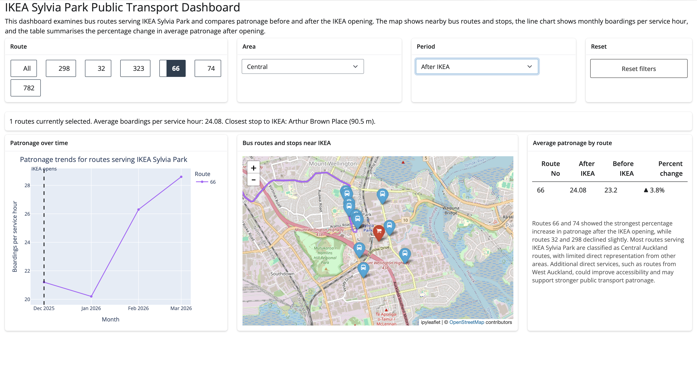
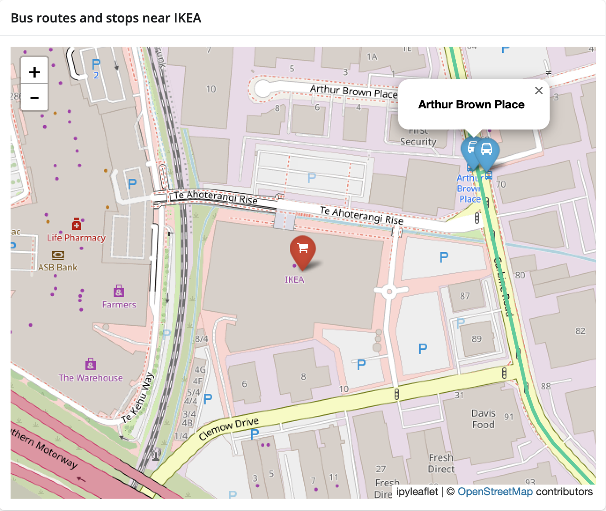
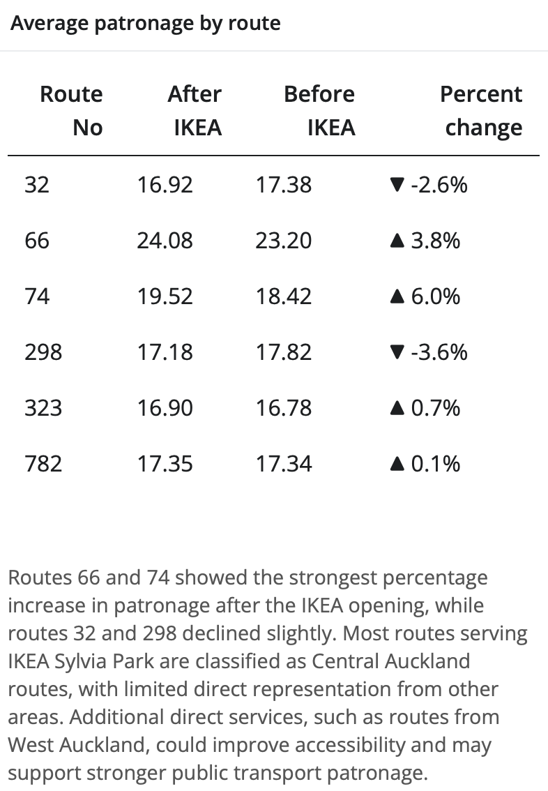
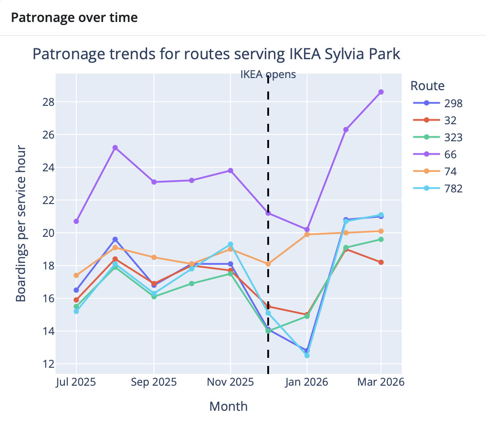

# 1. Motivation and Audience

This dashboard investigates public transport patronage for bus routes serving IKEA Sylvia Park in Auckland. The project explores whether bus patronage changed after the opening of the IKEA store and which routes experienced the largest changes in demand.

The dashboard is intended for transport planners, Auckland Transport staff, and members of the public interested in public transport accessibility around Sylvia Park. The app allows users to compare patronage before and after the IKEA opening, explore nearby bus routes spatially, and identify routes with the strongest increases or decreases in demand.

# 2. Data and Preparation

The dashboard uses Auckland Transport public transport patronage, bus route, and bus stop datasets. The original patronage dataset contained monthly weekday boardings per service hour for bus routes across Auckland, along with route classifications, target performance ranges, and regional groupings. Additional spatial datasets containing bus route geometries and bus stop locations were used to create the interactive map component.

Because the raw datasets included many unrelated routes and variables, substantial preprocessing was required to create a focused Sylvia Park study dataset.

Main datasets included:
- Weekday bus boardings per service hour
- Bus route geometries
- Bus stop locations
- Route-area classifications

Key variables included:
- Route number
- Boardings per service hour
- Month
- Area classification
- Stop names and coordinates

Data preparation was completed using Python, pandas, and GeoPandas. Cleaning and preparation steps included:
- Filtering routes serving the Sylvia Park area
- Reshaping the patronage dataset into long format for time-series analysis
- Creating before and after IKEA period classifications
- Calculating average patronage values
- Calculating percentage change summaries
- Reprojecting spatial datasets to EPSG:4326 for web mapping compatibility
- Preparing simplified spatial layers for efficient browser rendering

Spatial datasets were converted to WGS84 (EPSG:4326) to ensure compatibility with ipyleaflet and web basemaps.

Limitations of the data include:
- Limited temporal coverage
- No passenger origin-destination information
- Routes only classified broadly by area
- Patronage changes may reflect additional external factors unrelated to IKEA such as university holidays, festive season etc.
- Only bus services were included in the analysis, and train patronage data was not added.

# 3. Technical Architecture

The dashboard was developed using Shiny for Python and deployed using shinylive on GitHub Pages.

The application structure consists of:
- Reactive input controls
- Shared reactive filtering calculations
- Interactive map outputs
- Plotly chart outputs
- Summary tables and interpretation text

Reactive logic follows the structure:
```{mermaid}
flowchart LR
    Inputs --> FilteredData
    FilteredData --> Map
    FilteredData --> Chart
    FilteredData --> Summary
    FilteredData --> Table
```

Inputs → filtered dataset → outputs

User inputs include:
- Route selection
- Area selection
- Period selection
- Reset button

These inputs update:
- Interactive ipyleaflet map
- Plotly patronage chart
- Route comparison table
- Summary indicators, including:
  - number of selected routes
  - average boardings per service hour
  - closest stop to IKEA

Performance improvements included:
- Using shared reactive calculations to avoid repeated filtering
- Simplifying geometries to improve rendering speed
- Limiting map extent to the Sylvia Park area

The dashboard uses:
- pandas
- geopandas
- plotly
- ipyleaflet
- shiny
- shinywidgets

# 4. User Interface Walkthrough

## Dashboard overview



The dashboard contains four main components:
- Filter controls
- Interactive map
- Patronage time-series chart
- Summary comparison table

## Filtering workflow



Users can filter by:
- Route
- Area
- Before/after IKEA period

The reset button restores default selections where "All" is selected for all three filter options. Image shows filtering to route 66, area central, and period after IKEA. Changes can be seen to time series graph, map, and table. 

## Interactive map



The map displays:
- Bus routes serving bus stops within 1km of IKEA
- Bus stop locations within 1km of IKEA
- IKEA Sylvia Park location

Users can zoom and pan interactively. Clicking bus stops displays stop names.

## Patronage analysis





The line chart displays monthly patronage trends over time. A dashed line indicates the IKEA opening date. The summary table compares average patronage per month before and after opening and displays percentage change by route.

# 5. Limitations and Future Improvements

The dashboard currently focuses only on routes within the Sylvia Park study area and does not include train services or transiting patronage numbers.

Future improvements could include:
- Additional transport modes such as train patronage
- Accessibility analysis
- Origin-destination modelling
- More detailed demographic analysis
- Additional route coverage from West Auckland and other underserved areas

Further improvements could include using larger transport datasets, additional transport modes, and more advanced accessibility analysis. Performance could also be improved by simplifying spatial layers and reducing file sizes for faster browser loading as there are occasional delays in loading detailed spatial layers.

